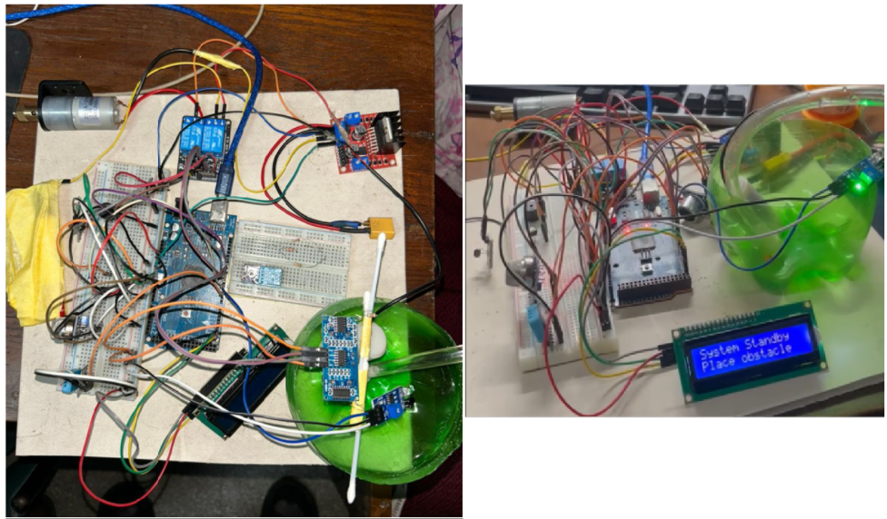
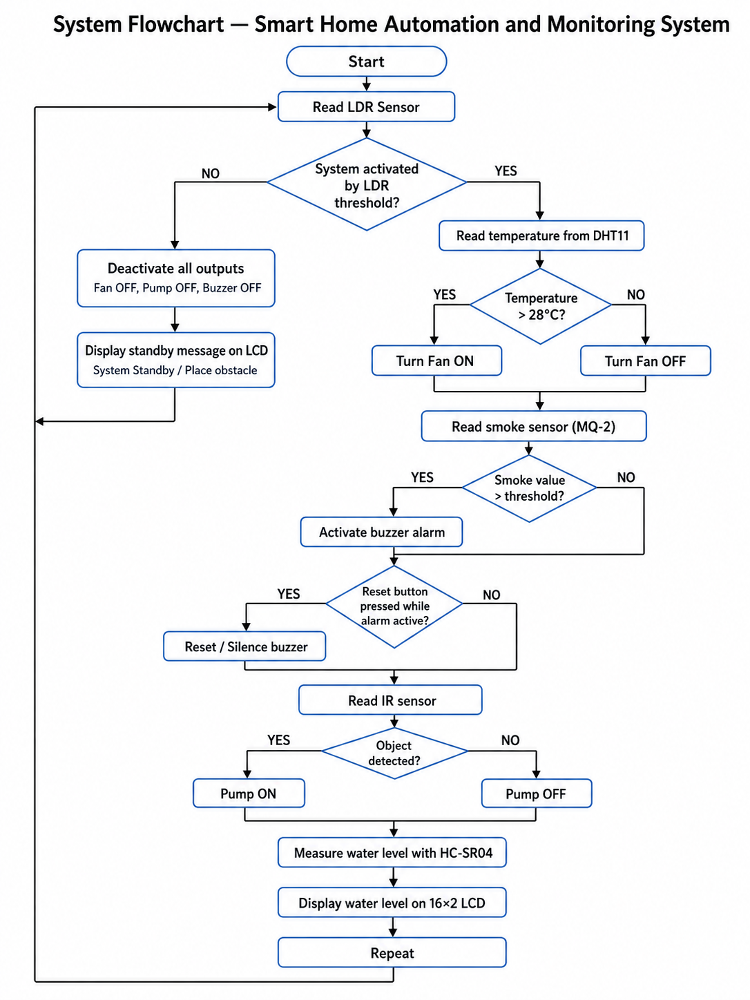
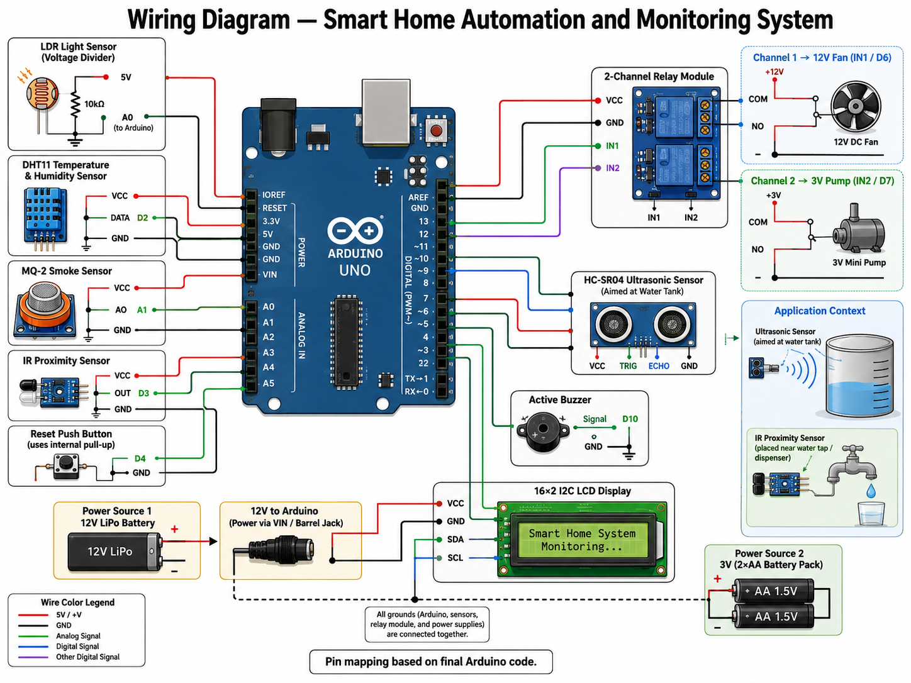

# Home Automation and Monitoring System using Arduino — EEE 4604

A **hardware-based smart home automation and monitoring system** developed using **Arduino Uno**. The project integrates multiple sensors and actuators to automate environmental monitoring, safety response, and water-level related utility functions inside a home environment.

**Course:** EEE 4604  
**Project Type:** Hardware Project  
**Platform:** Arduino Uno  
**Implementation:** Physical prototype only  
**Institution:** Islamic University of Technology (IUT)

---

## Overview

This project was developed as a complete **hardware prototype** for smart home automation and monitoring.  
The system combines sensing, control, and real-time status display to perform the following tasks:

- Activate the system based on ambient light level using an **LDR**
- Monitor room temperature using **DHT11**
- Automatically control a **12V fan** using a relay
- Detect smoke/gas using an **MQ-2 sensor**
- Trigger an alarm using a **buzzer**
- Reset the alarm manually using a **push button**
- Measure water level using an **HC-SR04 ultrasonic sensor**
- Display water level information on a **16×2 I2C LCD**
- Dispense water automatically using an **IR sensor** and **pump**
- Provide real-time monitoring through the **Serial Monitor**

This repository contains the source code, project documents, hardware diagrams, and project demonstration video.

---

## My Contribution

This project was developed collaboratively as part of our EEE 4604 coursework.

My contributions included:

- **Component Sourcing** — Helped identify and source the components required for the home automation and monitoring prototype.
- **Proteus Simulation** — Contributed to designing, running, and checking the circuit simulation in Proteus.
- **Testing & Debugging** — Assisted in testing the system and troubleshooting circuit, simulation, and integration issues during development.
- **Project Documentation** — Contributed to preparing the project report and documenting the system design, implementation, and results.

This was a collaborative team project, and the original repository is maintained by  
[Ar-Rafi-Ishraq](https://github.com/Ar-Rafi-Ishraq/Home-Automation-and-Monitoring-system-arduino-EEE4604).

## Features

The final hardware implementation supports:

- LDR-based system activation
- Automatic temperature monitoring
- Automatic fan control
- Smoke/gas detection and buzzer alarm
- Manual alarm reset
- Water-level monitoring using ultrasonic sensing
- Water-level display on LCD
- IR-based contactless water dispensing
- Relay-based switching of fan and pump
- Serial debugging and monitoring
- Real hardware prototype implementation

---

## Hardware Components

The project uses the following main components:

- Arduino Uno
- LDR (Light Dependent Resistor)
- DHT11 Temperature Sensor
- MQ-2 Smoke/Gas Sensor
- HC-SR04 Ultrasonic Sensor
- IR Proximity Sensor
- 16×2 I2C LCD Display
- 2-Channel Relay Module
- 12V DC Fan
- Mini Water Pump
- Active Buzzer
- Push Button
- Breadboard and jumper wires
- External battery / power sources

---

## System Operation

The system operates in the following way:

1. The **LDR** checks ambient light level.
2. If the light condition meets the activation threshold, the system becomes active.
3. The **DHT11** reads temperature.
4. If temperature exceeds the preset threshold, the **fan** is turned on through a relay.
5. The **MQ-2** detects smoke/gas concentration.
6. If smoke exceeds the threshold, the **buzzer alarm** is activated.
7. The **push button** can reset/silence the alarm.
8. The **IR sensor** detects the presence of a hand/object near the water outlet.
9. If an object is detected, the **pump** is activated.
10. The **HC-SR04** measures the water level of the storage tank.
11. The **LCD** displays water-level information in real time.
12. The system continuously repeats the monitoring cycle.

---

## Pin Mapping

The implementation in the final Arduino code uses the following pin mapping:

| Component | Signal | Arduino Pin |
|---|---|---:|
| LDR | Analog output | A0 |
| DHT11 | Data | 2 |
| MQ-2 | Analog output | A1 |
| IR Sensor | Digital output | 3 |
| Reset Button | Input | 4 |
| Fan Relay | IN1 | 6 |
| Pump Relay | IN2 | 7 |
| HC-SR04 | Trigger | 8 |
| HC-SR04 | Echo | 9 |
| Buzzer | Signal | 10 |
| LCD (I2C) | SDA | A4 |
| LCD (I2C) | SCL | A5 |

---

## Thresholds Used in Final Code

The final Arduino implementation uses the following thresholds:

| Parameter | Value |
|---|---:|
| LDR Activation Threshold | 750 |
| Temperature Threshold | 28°C |
| Smoke Threshold | 400 |

These values are based on the final working source code.

---

## Arduino Libraries Used

The source code uses the following libraries:

- `Wire.h`
- `LiquidCrystal_I2C.h`
- `DHT.h`

### Required Installation

Before uploading the code, ensure that the following Arduino libraries are installed:

- **LiquidCrystal I2C**
- **DHT sensor library**

`Wire.h` is included by default in the Arduino IDE.

---

## Project Figures

### Hardware Prototype

<p align="center">
  
</p>

This figure shows the physical hardware implementation of the smart home automation and monitoring system.

---

### System Flowchart

<p align="center">
  
</p>

This flowchart shows the overall decision-making and control sequence of the system.

---

### Wiring Diagram

<p align="center">
  
</p>

This diagram shows the connection layout of sensors, actuators, relay module, LCD, and Arduino Uno.

---

## Source Code

The main Arduino source code is available at:

[`Arduino/home_automation_monitoring.ino`](Arduino/home_automation_monitoring.ino)

This file contains the complete final implementation of the hardware system.

---

## How to Run

### 1. Install Arduino IDE

Install the Arduino IDE on your computer.

---

### 2. Install Required Libraries

Install the following libraries from the Arduino Library Manager:

- `LiquidCrystal_I2C`
- `DHT sensor library`

---

### 3. Open the Project File

Open:

```text
Arduino/home_automation_monitoring.ino
```

in the Arduino IDE.

---

### 4. Select Board and Port

Choose:

- **Board:** Arduino Uno
- **Port:** Correct COM port connected to the board

---

### 5. Upload the Code

Upload the sketch to the Arduino Uno.

---

### 6. Power the Hardware

Connect the system using the required external power sources for:

- Arduino
- Relay-driven fan
- Water pump

---

### 7. Observe Operation

Once powered, the system will:

- activate based on ambient light
- monitor temperature
- control the fan automatically
- detect smoke and trigger alarm
- measure water level
- control water dispensing
- display status information on LCD

---

## Demo Video

The project demonstration video is available in:

[`Demo/4604_Project_Demonstration.mp4`](Demo/4604_Project_Demonstration.mp4)

This video shows the real hardware prototype in operation.

---

## Repository Structure

```text
Home-Automation-and-Monitoring-system-arduino-EEE4604/
│
├── README.md
│
├── Arduino/
│   └── home_automation_monitoring.ino
│
├── Demo/
│   └── 4604_Project_Demonstration.mp4
│
├── Docs/
│   ├── EEE4604_Final_Project_Report.pdf
│   └── EEE4604_Project_Instructions.pdf
│
└── Figures/
    ├── hardware_prototype.png
    ├── system_flowchart.png
    └── wiring_diagram.png
```

---

## Project Scope

This project is a **hardware-only implementation**.

It does **not** include:

- Proteus simulation
- Tinkercad simulation
- Fritzing simulation
- web/mobile application
- cloud/IoT dashboard

The emphasis of this project is on **embedded hardware integration** using Arduino and discrete sensors/actuators.

---

## Technical Highlights

This project demonstrates:

- sensor integration
- analog and digital input handling
- relay-based actuator control
- environmental monitoring
- safety alarm implementation
- automatic fan control
- water-level measurement
- LCD interfacing
- Arduino-based real-time embedded control
- hardware-level system design

---

## Limitations

Current limitations of the project include:

- No mobile app or IoT remote control
- No cloud connectivity
- No simulation model included
- Thresholds are fixed in code
- Water-level calibration is basic
- Alarm system is local only
- No battery-management logic
- No data logging
- No long-term storage of sensor readings

---

## Possible Future Improvements

Possible future extensions include:

- Wi-Fi or IoT-based monitoring
- mobile application integration
- remote control through smartphone
- cloud dashboard for sensor data
- automatic notification system
- adjustable thresholds through software interface
- data logging to memory card or cloud
- more advanced water-level calibration
- intrusion detection module
- smart lighting control
- voice assistant integration

---

## Documentation

Project documents are available in:

- [`Docs/EEE4604_Project_Instructions.pdf`](Docs/EEE4604_Project_Instructions.pdf)
- [`Docs/EEE4604_Final_Project_Report.pdf`](Docs/EEE4604_Final_Project_Report.pdf)

These include:

- project instructions
- report details
- hardware description
- methodology
- implementation summary
- project results

---

## Team

This project was completed by **Team TENACIOUS**.

Team members:

- Ar Rafi Ishraq
- Ishrak Anan
- Taufeeq Hassan Omio
- Ashfiq Ul Rahman
- Mir Mushfiq Rahman Ramim
- Asiful Hoque Farabi

---

## Tools and Technologies

- Arduino Uno
- Embedded C / Arduino IDE
- DHT11
- MQ-2
- HC-SR04
- IR Sensor
- LDR
- 16×2 I2C LCD
- Relay Module
- Fan Control
- Pump Control
- Hardware Prototyping

---

## Academic Context

This project was completed for:

**EEE 4604**  
Department of Electrical and Electronic Engineering  
Islamic University of Technology (IUT)

The project focused on designing and building a practical smart home automation and monitoring prototype using Arduino and sensor-actuator integration.

---

## Repository Maintainer

**Ar-Rafi Ishraq**  
Electrical and Electronic Engineering
